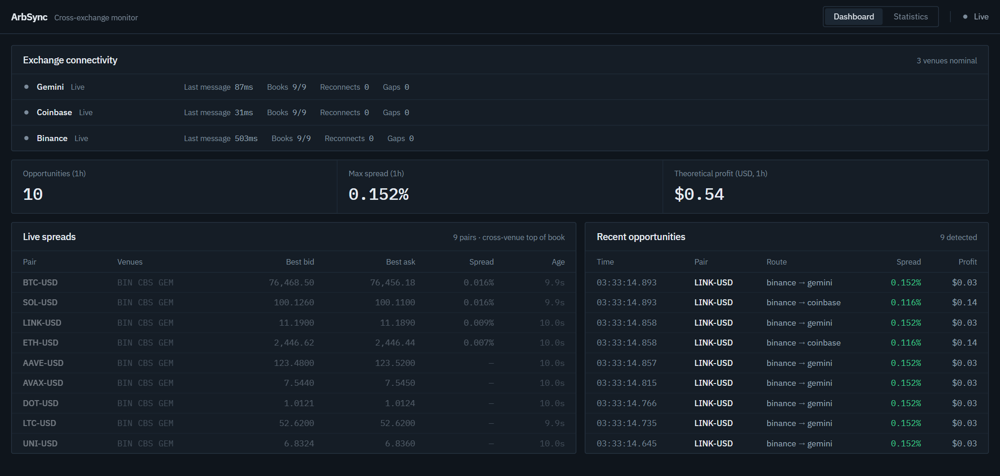
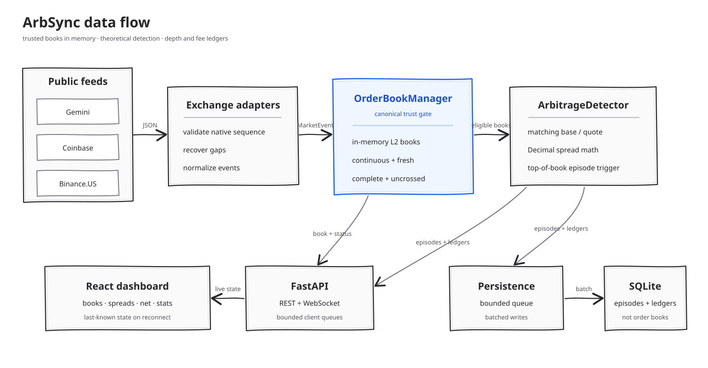

# ArbSync

[](https://github.com/KassaSana/ArbSync/actions/workflows/ci.yml)
[](https://github.com/KassaSana/ArbSync/actions/workflows/dependency-audit.yml)

ArbSync is a real-time, detection-only crypto arbitrage system. It consumes public
level-2 order books from Gemini, Coinbase, and Binance.US, normalizes each feed,
maintains trusted in-memory books, detects spreads only across matching base/quote markets, stores theoretical
opportunities in SQLite, and streams live state to a React dashboard.

No API keys are required. ArbSync does not place trades.

**Live demo:** [cross-exch-proj.vercel.app](https://cross-exch-proj.vercel.app) — the
dashboard is static, but its backend runs on a free tier that sleeps when idle, so the
first load can take up to a minute to connect. Everything below runs locally in a few
minutes without an account.





## What it demonstrates

- Concurrent WebSocket ingestion with exchange-specific reconnect and recovery logic
- Snapshot/delta sequencing and explicit book eligibility checks
- Event-driven arbitrage detection using `Decimal` prices and sizes
- Bounded persistence and dashboard queues so slow consumers do not block ingestion
- FastAPI REST, WebSocket, health, readiness, and Prometheus interfaces
- A React/TypeScript dashboard for spreads, feed health, opportunities, and statistics
- Fixture replay, property-based tests, synthetic benchmarks, and live-soak tooling

The default configuration tracks 9 assets on all 3 exchanges in USD: 27 exchange/pair
subscriptions forming 9 three-venue markets. See [`config.toml`](config.toml) for the
exact symbols.

## How data moves through the system

Recovery stays inside each exchange adapter because sequence semantics differ:
Binance.US aligns buffered deltas with a REST snapshot, Coinbase waits for a new
Level 2 stream snapshot, and Gemini reconnects for a new differential-depth snapshot.
The shared order-book module only accepts a continuous normalized stream.

See [`docs/ARCHITECTURE.md`](docs/ARCHITECTURE.md) for a component-by-component walkthrough
of book eligibility, detection, persistence, live delivery, and dashboard state.

## Run locally

Prerequisites:

- Python 3.11 or newer
- Node.js 22.22.2+, 24.15.0+, or 26+ (the locked frontend tools do not support Node 23 or 25)
- npm
- [uv](https://docs.astral.sh/uv/) for locked Python environments

From the repository root, create an environment and start the backend.

PowerShell:

```powershell
uv sync --locked --extra dev
uv run arbsync --config config.toml
```

macOS/Linux:

```bash
uv sync --locked --extra dev
uv run arbsync --config config.toml
```

The API listens only on `http://127.0.0.1:8000` by default. Hosting platforms that
supply `PORT` use that port and bind to `0.0.0.0`; set `ARB_HOST` to override the bind
address explicitly. In a second terminal, start the dashboard:

PowerShell:

```powershell
cd dashboard
npm ci
npm run dev
```

macOS/Linux:

```bash
cd dashboard
npm ci
npm run dev
```

Open `http://localhost:5173`. During development, Vite proxies REST and WebSocket
traffic to the local backend. Set `VITE_API_URL` when the backend uses another origin;
[`dashboard/.env.example`](dashboard/.env.example) shows the expected format.

## Configuration

Runtime settings live in [`config.toml`](config.toml). The `arbsync` command selects
configuration in this order: `--config PATH`, `ARB_CONFIG`, then `./config.toml`. It
does not silently fall back to packaged settings. Relative SQLite paths are resolved
from the selected configuration file's directory, so they do not change when the
application is launched from another working directory.

An installed package can generate a documented, loopback-only starting point:

```bash
arbsync --init-config ./config.toml
arbsync --config ./config.toml
```

Generation refuses to overwrite an existing file. Review the exchange symbols, CORS
origins, persistence limits, and freshness threshold before running it.

| Section | Controls |
| --- | --- |
| `detector` | Minimum spread percentage that emits an opportunity |
| `pricing` | Quote notionals walked to a VWAP, and the book sampling interval for fill rates |
| `fees` | Required per-venue taker percentages; optional maker percentages are validated but currently unused |
| `exchanges` | Exchange-native symbols to subscribe to |
| `server` | Bind address, port, SQLite path, and browser CORS allowlist |
| `persistence` | Batch size, flush interval, and bounded queue size |
| `order_books` | Maximum accepted age for otherwise trusted books |
| `reconciliation` | Full-cycle cadence, price/size confirmations, and recovery cooldown |
| `capture` | Bounded queue size for the capture writer |

Startup rejects invalid settings before opening exchange connections. Ports must be
between 1 and 65535; the detector threshold must be non-negative; persistence limits,
flush intervals, book age, reconciliation cadence, confirmation counts, and cooldown must
be positive. Supported exchange keys are `gemini`, `coinbase`, and `binance`. Symbols must
be nonblank and unique within an exchange after that exchange's normalization rules are
applied.

Environment variables used by the application:

| Variable | Purpose | Default |
| --- | --- | --- |
| `ARB_LOG_LEVEL` | Backend log level | `INFO` |
| `ARB_CONFIG` | Configuration file used when `--config` is absent | `./config.toml` |
| `ARB_HOST` | Explicit backend bind-address override | `config.toml`, or `0.0.0.0` when `PORT` is supplied |
| `ARB_CORS_ALLOWED_ORIGINS` | Comma-separated browser origins allowed to call the API | `server.cors_allowed_origins` from `config.toml` |
| `PORT` | Hosted-platform port override and external-bind signal | `server.port` from `config.toml` |
| `VITE_API_URL` | REST origin used by the dashboard; its scheme is converted for WebSockets | Local Vite proxy in development; hosted API in production |

Restart the backend after changing `config.toml` or these backend environment variables.

History is retained until explicitly pruned. See [SQLite maintenance](docs/STORAGE.md)
for bounded pruning, disk-growth estimates, backups, vacuum, and migration precautions.

## Hosted deployment

Binding to `0.0.0.0` exposes the service beyond the local machine. Put it behind a TLS-
terminating reverse proxy; direct public Uvicorn exposure is not a supported deployment.
Set `ARB_CORS_ALLOWED_ORIGINS` to the exact `https://` origins that host the dashboard
(for example, `https://dashboard.example.com`). Wildcards, paths, and query strings are
rejected so the browser allowlist cannot accidentally expand to every site. Same-origin
deployments can leave the list empty.

Configure the proxy to:

- Redirect HTTP to HTTPS and forward `X-Forwarded-Proto` and `X-Forwarded-For` only from
  trusted proxy addresses.
- Limit HTTP request bodies to 64 KiB or less. ArbSync's public API is read-only and does
  not accept uploads.
- Cap concurrent connections and WebSocket connections per client/IP, apply an idle timeout
  (60 seconds is a reasonable starting point), and preserve WebSocket upgrade headers.
- Apply a per-IP rate limit to REST and WebSocket handshakes. Start conservatively (for
  example, 60 REST requests/minute and 10 WebSocket handshakes/minute) and tune from proxy
  telemetry; health checks may need a separate allowance.
- Use upstream connect and response-header timeouts around 5 seconds, plus an appropriate
  streaming/WebSocket idle timeout. Do not buffer WebSocket traffic.

The uptime-reset control route was removed: uptime now represents the process lifetime.
These controls reduce exposure but do not make market data, theoretical opportunities, or
the dashboard suitable for trading or accounting decisions.

## Useful interfaces

| Interface | Purpose |
| --- | --- |
| `GET /` | Service identity and pointers to the interfaces below |
| `GET /healthz` | Process liveness |
| `GET /readyz` | Adapter, book, and background-task readiness |
| `GET /api/adapters` | Connection age, reconnects, gaps, and last errors |
| `GET /api/book-status` | Eligibility and freshness for every configured book |
| `GET /api/pairs` | Configured and observed `(exchange, pair)` roster, including cold start |
| `GET /api/opportunities/recent?limit=50` | Recent theoretical opportunity episodes, open ones first by start (`limit`: 1–500) |
| `GET /api/stats?window=1h` | Basic opportunity statistics |
| `GET /api/system/overview` | Uptime, all-time peaks, open episode count and all-time lifetimes |
| `GET /api/system/stats?window=1h` | Windowed aggregate statistics and episode lifetime p50/p90/max |
| `GET /api/system/timeseries?window=1h&bucket_seconds=60` | Chart buckets (`bucket_seconds`: 1–86,400) |
| `GET /api/pricing/depth?pair=BTC-USD` | Depth-walked venue VWAPs plus directed route ledgers through depth impact, taker fees and net spread (`pair` optional) |
| `GET /api/pricing/fill-rates` | How often each venue could fill each notional across periodic samples |
| `GET /metrics` | Prometheus exposition |
| `WS /ws/live` | Initial state followed by live book/status/opportunity messages |

FastAPI's interactive schema is available at `http://127.0.0.1:8000/docs` while
the backend is running. Nanosecond timestamps are serialized as decimal strings so
JavaScript clients do not lose integer precision.

Canonical market and opportunity values are stored and transmitted as decimal strings.
Derived minute rollups and aggregate dashboard statistics use SQLite binary64 values for
efficient observability queries, so they are approximate and should not be used for
accounting or execution decisions.

USD and USDT are separate quote assets. ArbSync does not infer a conversion or parity between
them: `BTC-USD` is compared only with other `BTC-USD` books, while `BTC-USDT` remains a
separate market. The shipped configuration subscribes to Binance.US's USD markets so that all
three venues compare the same quote asset; its USDT symbols are still accepted and form their
own markets. Theoretical profit is reported in its pair's quote asset, and dashboard/API
profit totals are grouped by quote asset rather than added across currencies.

Opportunities are stored as **episodes**: one row per `(pair, buy venue, sell venue)` route from
the moment its spread crosses the threshold to the moment it stops, with the peak spread, the
size and profit at that peak, the spread at close and why it closed (`spread_closed`,
`book_ineligible`, `shutdown`, `orphaned`). A spread that rests across hundreds of book updates is one
episode, so counts and profit sums describe distinct dislocations, and every normally closed
episode has a lifetime measured on the monotonic clock. An episode a previous process left
open is marked `orphaned`: it keeps its count, contributes no lifetime, and must not appear as
currently open. An episode closes when its spread narrows, when a
leg's book is rejected, invalidated or disconnected, or at shutdown; a leg that merely ages past
the freshness threshold with no further events on either venue is noticed at the next event, so
a thin pair's lifetime can overrun by that gap. Schema version 4 adds stored fee/depth ledgers;
version 3 databases migrate in place, while versions before 3 drop earlier per-update rows on
startup because they cannot be folded into episodes after the fact; back up first if that
history matters. The earlier quote-currency migration likewise cleared Binance.US USDT rows
that had been labelled USD.

Depth pricing walks each eligible book to the volume-weighted average price for the configured
notionals (`100`, `1000`, `10000`, `50000` quote units by default), in exact decimal arithmetic.
When the subscribed depth cannot cover a notional the result is an explicit `insufficient_depth`
with the amount that was available, never a fabricated price. Every quote carries the venue's
`subscribed_depth_levels` (`5000` for Binance.US, whose snapshot is capped; `null` for Coinbase
and Gemini, which stream full books) because a fill rate on a capped book is not comparable
with one on a full book. Fill rates come from periodic samples of every book, off the ingestion
path; an ineligible book is counted as an ineligible sample, not as a failed fill.

Fee-aware route pricing keeps the tiers explicit. `spread_pct` and `theoretical_profit` remain
top-of-book theoretical values. For each configured quote budget, the buy leg is walked to that
notional and the sell leg is priced at exactly the acquired base quantity. The route ledger
records both depth-walked VWAPs, gross executable spread, measured depth impact, the configured
taker fee on each leg, fee impact, and net executable spread. Insufficient depth leaves executable and net
values `null`. All ledger numbers are decimal strings on the wire and in the episode's SQLite
`TEXT` document. There is no fee default: every configured venue must have a `taker_pct`, so a
missing schedule stops startup instead of silently treating a route as free.

## Verify a change

Run backend checks from the repository root:

```powershell
uv run pytest -q server/tests
uv run mypy --strict server/arb
uv run ruff check server tools
uv run ruff format --check server tools
```

Install or run the same cross-platform checks as Git hooks:

```powershell
uv run pre-commit install
uv run pre-commit run --all-files
```

Run frontend checks from `dashboard/`:

```bash
npm run typecheck
npm run lint
npm run test
npm run test:coverage
npm run build
```

The backend suite covers protocol recovery, canonical book eligibility, detection,
persistence, API behavior, and capture/replay. CI runs tests with coverage,
strict type checking, linting, and the production dashboard build. The dated verification
baseline lives in [`docs/VALIDATION.md`](docs/VALIDATION.md).

## Benchmarks, capture, and replay

Record real traffic and replay it through the production pipeline without network
access; replaying the same capture twice produces identical book transitions and
detector outputs:

```bash
arbsync capture --duration 150s --output var/capture.jsonl.gz
arbsync replay var/capture.jsonl.gz
arbsync replay var/capture.jsonl.gz --serve
```

`--serve` streams the capture through the dashboard API at real-time pacing
(`--speed 2` doubles it), so the dashboard runs with no live backend. A
three-venue sample lives under
[`server/tests/fixtures/captured/`](server/tests/fixtures/captured/README.md)
and is replayed deterministically by the backend suite.

The committed synthetic results are hardware-specific and do not represent live
exchange or network performance.

| Path | p50 | p95 | Throughput |
| --- | ---: | ---: | ---: |
| Detector only | 3.42 us | 3.88 us | 16,454,491 evaluations/min |
| Synthetic ingest-to-detection | 16.00 us | 17.33 us | 1,920,581 events/min |

Reproduce them from the repository root:

```powershell
uv run python tools/benchmark.py
uv run python tools/bench_e2e.py --iterations 10000
```

See [`docs/BENCHMARKS.md`](docs/BENCHMARKS.md) for methodology and
[`artifacts/benchmarks/results.json`](artifacts/benchmarks/results.json) for the
committed raw results.
The live observer is documented there as well. The committed long-duration evidence is a
four-hour uninterrupted live soak from 2026-09-16, reviewed in
[`docs/VALIDATION.md`](docs/VALIDATION.md#live-soak-2026-09-16).

## Repository map

```text
server/arb/          Backend modules
  adapters/          Gemini, Coinbase, and Binance.US feed adapters
  api.py             HTTP/WebSocket interfaces and live broadcasting
  orderbook.py       L2 state and the canonical eligibility decision
  detector.py        Cross-exchange spread calculation
  persistence.py     Batched SQLite writes and statistics queries
  reconcile.py       Periodic live-versus-REST comparison
  main.py            Application wiring and task supervision
server/tests/        Unit, property, replay, and pipeline tests
dashboard/src/       React/TypeScript dashboard
tools/                Benchmark, replay, profiling, and soak utilities
artifacts/benchmarks/ Machine-readable results and live-run artifacts
docs/ARCHITECTURE.md Architecture and end-to-end application walkthrough
docs/BENCHMARKS.md   Benchmark and soak methodology
docs/RESYNC.md       Current recovery design decision
docs/VALIDATION.md   Verified behavior and remaining validation evidence
var/                  Ignored local database, logs, and temporary files
```

## Scope and limitations

Every reported opportunity and profit value is theoretical. Calculations exclude
trading and withdrawal fees, slippage, transfer latency, inventory constraints,
partial fills, rate limits, and execution risk. The detector uses only top-of-book
liquidity and is an observability project, not an execution engine or trading system.
Measured against the four-hour soak (run while Binance.US was configured for USDT, so its
books were a separate market), none of the 246 recorded Coinbase–Gemini opportunities
survives a retail taker fee on both legs; the observed venue price differences (p50 0.12%)
are smaller than the venue fee differences. The analysis and the tool that reproduces it are
in [`docs/VALIDATION.md`](docs/VALIDATION.md#fee-adjusted-survival-of-the-soaks-opportunities).

Long-duration evidence is a single four-hour uninterrupted live soak on one workstation.
It establishes reconnect recovery, sequence continuity, the 60-second freshness threshold,
and the absence of short-horizon memory growth; it does not rule out slower growth or
daily-cycle effects, and it exercised a lightweight WebSocket consumer rather than real
browser clients. The remaining gaps are listed in
[`docs/VALIDATION.md`](docs/VALIDATION.md#remaining-validation-gap).

## Contributing and support

See [CONTRIBUTING.md](CONTRIBUTING.md) for setup, checks, and review expectations,
and follow the [code of conduct](CODE_OF_CONDUCT.md). Use the repository's issue
templates for bugs, protocol correctness, and feature requests. Report vulnerabilities
privately using [SECURITY.md](SECURITY.md), which also defines supported versions.
User-facing changes are in [CHANGELOG.md](CHANGELOG.md); versioning and candidate
checks are defined in the [release process](docs/RELEASING.md).

## License

ArbSync is licensed under the [Apache License 2.0](LICENSE). See the
[dependency license audit](docs/DEPENDENCY_LICENSES.md) for the compatibility review
of the current Python and dashboard dependency sets.
